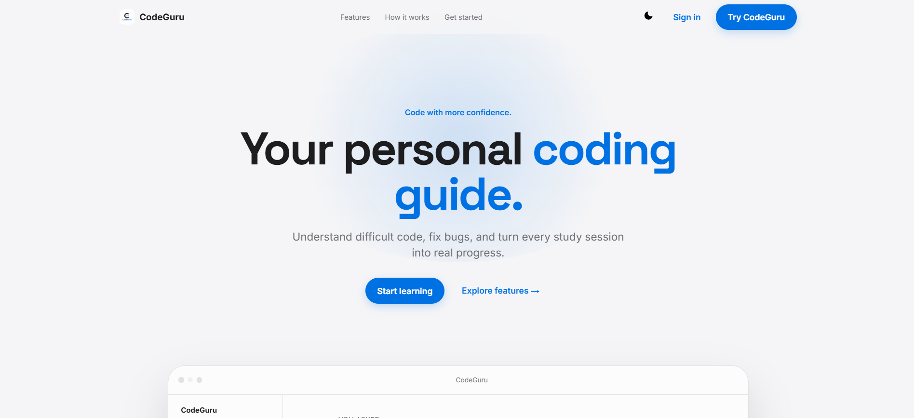
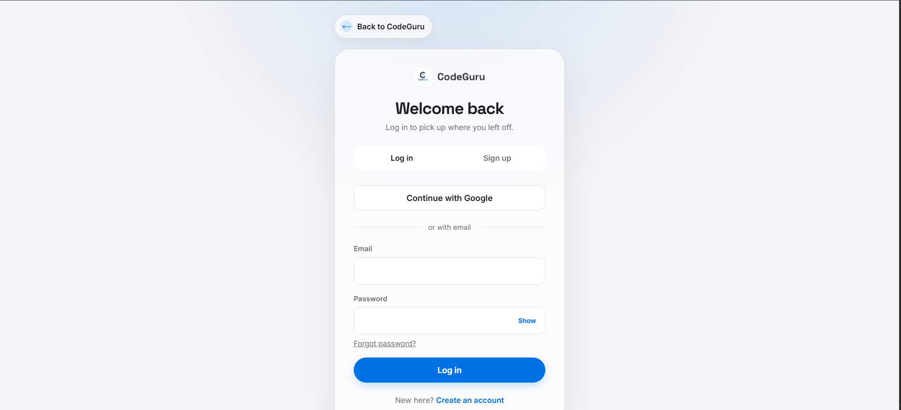
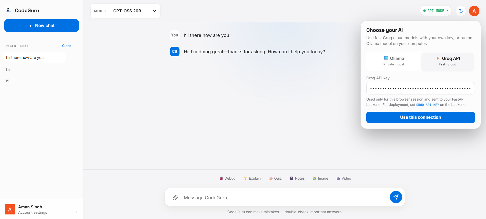

# CodeGuru 2.0

<p align="center">
  
</p>

<h1 align="center">CodeGuru 2.0</h1>

<p align="center">
  <strong>Your Personal Coding Guide</strong>
</p>

<p align="center">
  Understand difficult code, fix bugs, practice concepts, generate notes, and learn with AI.
</p>

<p align="center">
  <a href="https://github.com/amnsingh05/code-guru-2.0">Repository</a>
  ·
  <a href="https://www.linkedin.com/in/amnsingh0/">Aman Singh</a>
  ·
  <a href="#getting-started">Getting Started</a>
</p>

---

## 📌 Overview

**CodeGuru 2.0** is an AI-powered coding and learning assistant designed to help students and developers understand programming concepts, debug code, practice topics, and work with their own documents.

The project combines a modern HTML/CSS/JavaScript frontend with a **FastAPI backend**, **LangChain-based RAG workflows**, **Ollama local models**, **Groq cloud models**, and **Firebase Authentication**.

CodeGuru supports both local and cloud AI workflows:

- **Ollama** for running supported models locally.
- **Groq API** for fast cloud inference using your own API key.
- **RAG** for retrieving relevant information from uploaded files.
- **Firebase Authentication** for account management.
- **SQLite-backed chat history** through the FastAPI backend.

---

## ✨ Features

### 🤖 AI Chat

Chat with CodeGuru using supported AI models and maintain conversations through the dashboard.

### 🧠 Model Selection

Choose between supported local Ollama models and Groq cloud models from the application.

### 🐛 Code Debugging

Paste code and ask CodeGuru to identify errors, explain the issue, and help you understand possible fixes.

### 💡 Concept Explanation

Ask questions about programming and technical concepts and receive explanations in a conversational interface.

### 📝 Automatic Notes

Generate structured notes from learning material or conversations.

### ❓ Practice Quizzes

Create practice questions to test your understanding of a topic.

### 🎥 Video Explainers

Generate animated/video-style explanations for supported learning requests.

### 🖼️ Image Generation

Use the image-generation feature from the CodeGuru interface when configured.

### 📎 File Upload & RAG

Upload supported documents and source files and use retrieval-augmented generation to ask questions about their contents.

### 🔐 Authentication

Users can sign in using:

- Email and password
- Google authentication
- Password reset

Authentication is handled through Firebase.

### 💬 Chat History

Previous conversations can be accessed from the dashboard, with options to create new chats, delete chats, and clear chat history.

### 🌙 Light & Dark Mode

The frontend includes a theme switcher with persistent theme preference.

---

# 🖥️ Screenshots

## Landing Page



## Login & Sign Up



## AI Chat Dashboard



---

# 🏗️ How It Works

```text
                    ┌─────────────────────────┐
                    │       User / Student    │
                    └────────────┬────────────┘
                                 │
                                 ▼
                    ┌─────────────────────────┐
                    │   CodeGuru Web Frontend │
                    │ HTML • CSS • JavaScript  │
                    └────────────┬────────────┘
                                 │
                         HTTP / REST API
                                 │
                                 ▼
                    ┌─────────────────────────┐
                    │      FastAPI Backend    │
                    │      Python + RAG       │
                    └────────────┬────────────┘
                                 │
                    ┌────────────┴────────────┐
                    │                         │
                    ▼                         ▼
          ┌──────────────────┐      ┌──────────────────┐
          │   Ollama Local   │      │    Groq Cloud    │
          │   AI Models      │      │    AI Models     │
          └──────────────────┘      └──────────────────┘
                    │                         │
                    └────────────┬────────────┘
                                 │
                                 ▼
                    ┌─────────────────────────┐
                    │   RAG / File Retrieval  │
                    │ Chroma + Embeddings     │
                    └────────────┬────────────┘
                                 │
                                 ▼
                    ┌─────────────────────────┐
                    │   Response to User      │
                    └─────────────────────────┘
```

---

# 🧰 Tech Stack

## Frontend

- HTML5
- CSS3
- JavaScript
- Responsive UI
- Light/Dark theme support

## Backend

- Python
- FastAPI
- Uvicorn
- REST API
- SQLite

## AI / GenAI

- LangChain
- Ollama
- Groq API
- RAG
- Chroma
- Embeddings

## Authentication

- Firebase Authentication
- Google Sign-In
- Email/Password Authentication

## Document Processing

- PyPDF
- PyMuPDF
- Python-docx
- python-pptx
- OpenPyXL
- Pillow
- Tesseract OCR
- CSV/text/code processing

## Deployment

- Vercel for frontend hosting
- FastAPI backend hosting can be configured separately
- Ollama requires access to a machine running Ollama

---

# 📂 Project Structure

A simplified structure of the project is:

```text
code-guru-2.0/
│
├── assets/
│   ├── codegurulogo.png
│   ├── codeguru-dashboard.png
│   ├── codeguru-login.png
│   └── codeguru-landing-page.png
│
├── auth.js
├── api-config.js
├── api.js
├── chat.js
├── dashboard.html
├── features-data.js
├── firebase-config.js
├── index.html
├── login.html
├── style.css
├── theme.js
├── vercel.json
│
├── codeguru_backend.py
├── requirements.txt
│
└── README.md
```

> The exact repository structure can contain additional development or configuration files. The files above represent the main application components.

---

# ⚙️ Getting Started

## 1. Clone the Repository

```bash
git clone https://github.com/amnsingh05/code-guru-2.0.git
cd code-guru-2.0
```

---

## 2. Install Python 3.10

The backend is intended to run with **Python 3.10**.

Check your Python version:

```bash
python --version
```

or:

```bash
py --version
```

If multiple Python versions are installed, you can create the environment explicitly with Python 3.10:

```bash
py -3.10 -m venv .venv
```

Activate it on Windows PowerShell:

```powershell
.venv\Scripts\Activate.ps1
```

If PowerShell blocks script execution, use Command Prompt:

```cmd
.venv\Scripts\activate.bat
```

---

## 3. Install Backend Dependencies

With the virtual environment activated:

```bash
pip install -r requirements.txt
```

The backend dependencies include FastAPI, LangChain, Chroma, Ollama integration, document loaders, Groq, and other required packages.

---

# 🦙 Ollama Setup

CodeGuru can use Ollama for local inference.

Install Ollama and make sure the Ollama service is running.

The project is configured around the following models:

```text
qwen3:8b
llama3.1:8b
gemma3:4b
nomic-embed-text
```

Pull the required models:

```bash
ollama pull qwen3:8b
ollama pull llama3.1:8b
ollama pull gemma3:4b
ollama pull nomic-embed-text
```

Check installed models:

```bash
ollama list
```

The default Ollama endpoint used by the application is:

```text
http://localhost:11434
```

> Model availability and resource requirements depend on the local machine.

---

# ⚡ Groq API Setup

CodeGuru can also use Groq cloud inference.

You can provide your Groq API key through the application's AI connection interface.

For backend deployment, configure:

```text
GROQ_API_KEY=your_groq_api_key
```

Do not commit real API keys to GitHub.

The dashboard can use a Groq key for the current browser session. The backend can also be configured with `GROQ_API_KEY` for deployment.

---

# 🚀 Run the FastAPI Backend

Start the backend with:

```bash
uvicorn codeguru_backend:app --host 0.0.0.0 --port 8000
```

The API should then be available at:

```text
http://localhost:8000
```

FastAPI's interactive documentation is available at:

```text
http://localhost:8000/docs
```

---

# 🌐 Run the Frontend

The frontend is a static HTML/CSS/JavaScript application.

For local development, serve the project using a development server such as **VS Code Live Server**.

For example:

```text
http://localhost:5500
```

Do not open the frontend directly using:

```text
file:///
```

The application expects the frontend to communicate with the FastAPI backend through HTTP requests.

---

# 🔧 Backend URL Configuration

The frontend backend URL is configured through:

```text
api-config.js
```

For local development, the backend will normally use:

```text
http://localhost:8000
```

For deployment, configure the frontend to point to your publicly accessible FastAPI backend.

---

# 🔄 Application Flow

The main application flow is:

```text
User
  │
  ▼
Login / Sign Up
  │
  ▼
Firebase Authentication
  │
  ▼
CodeGuru Dashboard
  │
  ├── New Chat
  │
  ├── Select Model
  │
  ├── Ask Question
  │
  ├── Upload File
  │
  ├── Debug Code
  │
  ├── Explain Concept
  │
  ├── Practice Quiz
  │
  ├── Generate Notes
  │
  ├── Generate Image
  │
  └── Video Explainer
  │
  ▼
FastAPI Backend
  │
  ├── Ollama
  │
  ├── Groq
  │
  └── RAG Pipeline
  │
  ▼
AI Response
```

---

# 📚 RAG Pipeline

CodeGuru supports retrieval-augmented generation for uploaded files.

The general flow is:

```text
File Upload
     │
     ▼
Document Loading
     │
     ▼
Text Extraction
     │
     ▼
Text Splitting
     │
     ▼
Embeddings
     │
     ▼
Chroma Vector Store
     │
     ▼
Similarity Retrieval
     │
     ▼
Relevant Context
     │
     ▼
AI Model
     │
     ▼
Answer
```

Uploaded content is associated with the relevant chat/session so retrieval can be scoped to that conversation.

---

# 📎 Supported File Types

The dashboard supports file attachments including:

- `.txt`
- `.md`
- `.py`
- `.js`
- `.ts`
- `.jsx`
- `.tsx`
- `.json`
- `.html`
- `.css`
- `.java`
- `.c`
- `.cpp`
- `.h`
- `.sql`
- `.csv`
- `.pdf`
- `.doc`
- `.docx`
- `.png`
- `.jpg`
- `.jpeg`
- `.webp`

Some PDF/image workflows may require OCR support through Tesseract.

---

# 🔐 Authentication

Firebase Authentication is used for account access.

Supported authentication flows include:

- Email/password login
- New account registration
- Google login
- Password reset
- User session handling
- Profile/account controls

Firebase web configuration is included for the client application. The configuration itself is not treated as a private API secret; however, Firebase Authentication, Firestore, and Storage security rules must be configured correctly to protect user data.

---

# 💾 Chat History

CodeGuru maintains chat sessions through the backend.

The application supports:

- Creating a new chat
- Loading previous chats
- Sending messages
- Deleting chats
- Clearing chat history
- Associating uploaded files with chat sessions

The backend uses SQLite for application chat persistence.

---

# 🤖 Supported AI Providers

## Ollama

Ollama provides local model execution.

Advantages:

- Local inference
- No cloud model API key required
- User-controlled model runtime
- Useful for privacy-focused local workflows

The Ollama service must be running on the machine accessible by the backend.

## Groq

Groq provides cloud inference through its API.

Advantages:

- Fast cloud inference
- No local model download required
- Suitable for users who want cloud-hosted model execution

A valid Groq API key is required.

---

# ☁️ Deployment

## Frontend

The frontend can be deployed to a static hosting provider such as Vercel.

A Vercel configuration is included in:

```text
vercel.json
```

The frontend can use an environment variable such as:

```text
CODEGURU_API_URL
```

to point to the deployed FastAPI backend.

## Backend

The FastAPI backend must be hosted on a server/platform capable of running Python.

Configure environment variables such as:

```text
GROQ_API_KEY
CODEGURU_ALLOWED_ORIGINS
```

for the backend.

## Important Ollama Deployment Note

A static frontend deployed on Vercel cannot directly access Ollama running on a user's private computer.

For a fully cloud-hosted setup, the backend must be able to reach the configured AI provider.

A typical deployment architecture is:

```text
Browser
   │
   ▼
Vercel / Static Frontend
   │
   ▼
Public FastAPI Backend
   │
   ├── Groq API
   │
   └── Ollama Server
```

---

# 🛡️ Security Notes

Never commit private secrets to the repository.

Do not place:

```text
GROQ_API_KEY
```

or other private credentials directly into source-controlled files.

Recommended practices:

- Use environment variables for backend secrets.
- Keep `.env` files out of Git.
- Configure Firebase security rules properly.
- Restrict backend CORS origins in production.
- Do not expose private credentials in frontend source code.
- Rotate API keys if they are accidentally exposed.

---

# 🧪 Development

For local development, the recommended workflow is:

```text
1. Start Ollama
2. Activate Python environment
3. Start FastAPI backend
4. Start frontend with Live Server
5. Open CodeGuru in the browser
6. Sign in
7. Select an AI provider/model
8. Start a chat
```

---

# 🧩 Main Components

| Component | Purpose |
|---|---|
| `index.html` | CodeGuru landing/marketing page |
| `login.html` | Login and sign-up interface |
| `dashboard.html` | Main AI chat dashboard |
| `auth.js` | Authentication-related frontend logic |
| `chat.js` | Chat interface and interaction logic |
| `api.js` | Frontend API communication |
| `api-config.js` | Backend API configuration |
| `features-data.js` | Feature definitions/content |
| `firebase-config.js` | Firebase client configuration |
| `theme.js` | Light/dark theme handling |
| `style.css` | Main frontend styling |
| `codeguru_backend.py` | FastAPI backend |
| `requirements.txt` | Python dependencies |
| `vercel.json` | Vercel configuration |
| `assets/` | Logo and project screenshots |

---

# 👥 Team

## Aman Singh — Project Lead

**Role:** Project Lead / Main Developer

- GitHub: [@amnsingh05](https://github.com/amnsingh05)
- LinkedIn: [Aman Singh](https://www.linkedin.com/in/amnsingh0/)

Aman leads the CodeGuru 2.0 project and is responsible for the main project development and integration.

## Aksh Jain — Collaborator

- LinkedIn: [Aksh Jain](https://www.linkedin.com/in/aksh-jain-58a705203/)

## Aaryan Sharma — Collaborator

- LinkedIn: [Aaryan Sharma](https://www.linkedin.com/in/aaryan-sharma-a341a732b/)

---

# 🔗 Repository

**GitHub:**  
https://github.com/amnsingh05/code-guru-2.0

---

# 🗺️ Future Scope

Potential future improvements include:

- More AI model providers
- More local Ollama models
- Better code analysis
- Improved RAG retrieval
- Streaming responses
- More document formats
- Advanced code execution/sandboxing
- Personalized learning paths
- Improved quiz generation
- More visual learning tools
- Better deployment support
- Additional developer utilities

---

# 🤝 Contributing

Contributions, suggestions, and improvements are welcome.

A typical contribution workflow is:

```bash
git checkout -b feature/your-feature
```

Make your changes, test them locally, then commit:

```bash
git add .
git commit -m "feat: add your feature"
```

Push the branch:

```bash
git push origin feature/your-feature
```

Then open a pull request on GitHub.

---

# 📄 License

A license has not been specified in the current project documentation.

If this project is intended to be open source, add an appropriate `LICENSE` file to the repository.

---

# 🙌 Acknowledgements

CodeGuru 2.0 brings together several open-source and developer technologies, including:

- FastAPI
- LangChain
- Ollama
- Chroma
- Groq
- Firebase
- Python
- JavaScript
- Vercel

---

# ⚠️ Disclaimer

AI-generated answers can contain mistakes.

Always review generated code, explanations, notes, and other AI output before using them in production, academic submissions, or security-sensitive applications.

---

# ⭐ CodeGuru 2.0

<p align="center">
  <strong>Learn. Debug. Build. Repeat.</strong>
</p>

<p align="center">
  Built to make coding and learning easier with AI.
</p>
